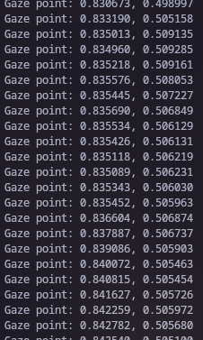

#### This repo features a modified version of the official Tobii Pro drivers to enable support of the IS4/IS5 [Eye Tracker 4c and 5]

The deps packages were obtained from the tobii page:
https://developer.tobii.com/consumer-eye-trackers/stream-engine/getting-started

The manager is obtained from:
https://www.tobiipro.com/es/learn--support/downloads/
(Changed to: https://www.tobiipro.com/product-listing/eye-tracker-manager/)

I have pre-applied modifications to get the manager to run as to simplify the install experience.
The changes made are below:
```
cd /opt/TobiiProEyeTrackerManager/resources

asar extract app.asar app.asar.unpack
rm app.asar

sed -ri "s/types_1\.EtmModuleType\.TELEMETRY//g" app.asar.unpack/config.js
sed -ri "s/TPSP1/IS5FF/g" app.asar.unpack/main.*.js

asar pack app.asar.unpack app.asar
rm -rf app.asar.unpack
```
This allows the manager to launch and operate normally

#### Instalation
Download the .pkgs from the Releases section
```
cd ~/Downloads (or wherever you have your downloads from your browser set to go)

pacman -U ./tobii_engine_linux-0.1.6.193rc-1-x86_64.pkg.tar.zst ./tobiiproeyetrackermanager-2.6.1-1-x86_64.pkg.tar.zst ./tobiiusbservice-2.1.5-1-x86_64.pkg.tar.zst

git clone https://github.com/megagtrwrath/tobii_eye_tracker_linux_installer

cd ~/tobii_eye_tracker_linux_installer/Services

cp ./tobii_engine.service /etc/systemd/system/tobii_engine.service
cp ./tobii_usb.service /etc/systemd/system/tobii_usb.service

systemctl enable --now tobii_engine tobii_usb

```
#### Configuration

Run the Tobii Pro Eye Tracker Manager:
```
/opt/TobiiProEyeTrackerManager/TobiiProEyeTrackerManager
```
Calibrate the device


#### Run the example code
```
cd example

gcc  main.cpp -o main -pthread /usr/lib/tobii/libtobii_stream_engine.so

./main
```


You will see how the tracker captures the position of the screen you are looking at


#### Test env:

Distro: Arch Linux

Kernel: 6.18.9-zen1-1.1-zen

CPU: AMD Ryzen 7 7800x3D
GPU: AMD Radeon RX7900XTX

WM: Hyprland

#### Known issues:
Head_Pose data stream doesn't appear to function, meaning this does not yet work for Head Tracking.
