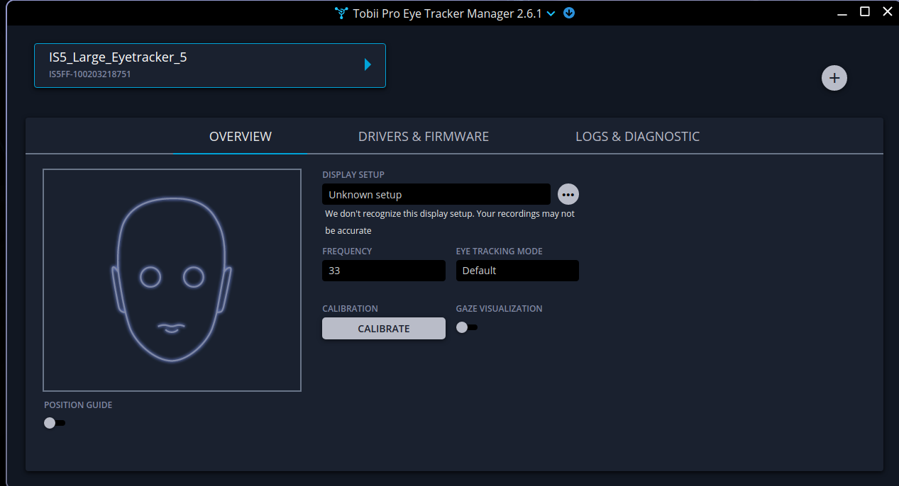

It allows to install the drivers and development libraries to operate devices compatible with IS4 (Tobii 4C) and Tobii Eye Tracker 5.

The deps packages were obtained from the tobii page:
https://developer.tobii.com/consumer-eye-trackers/stream-engine/getting-started

The manager is obtained from:
https://www.tobiipro.com/es/learn--support/downloads/
(Changed to: https://www.tobiipro.com/product-listing/eye-tracker-manager/)

#### Instalation

CD ./tobii_eye_tracker_linux_installer

pacman -U ./tobii_engine_linux-0.1.6.193rc-1-x86_64.pkg.tar.zst ./tobiiproeyetrackermanager-1.12.1-1-x86_64.pkg.tar.zst ./tobiiusbservice-2.1.5-1-x86_64.pkg.tar.zst

#### Configuration

Run the Tobii Pro Eye Tracker Manager:
/opt/TobiiProEyeTrackerManager/TobiiProEyeTrackerManager

Calibrate the device

#### Run the example code

cd example

gcc  main.cpp -o main -pthread /usr/lib/tobii/libtobii_stream_engine.so

./main

You will see how the tracker captures the position of the screen you are looking at

#### Test env:

Distro: Arch Linux

Kernel: 6.18.9-zen1-1.1-zen

CPU: AMD Ryzen 7 7800x3D
GPU: AMD Radeon RX7900XTX

WM: Hyprland

#### Known issues:
Tobii USB Service relies on a directory existing that it does not automatically generate, and it does not currently have a systemD service.
To get this to work you need to:
sudo mkdir /run/tobiiusb
sudo tobiiusbserviced
You will need to do this every reboot.

If anyone is willing to create a systemD service to automate this, please do raise a PR with it!
